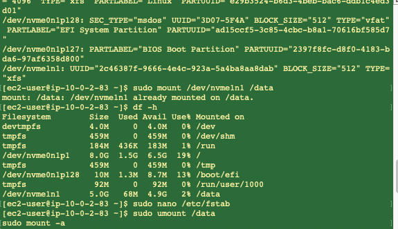
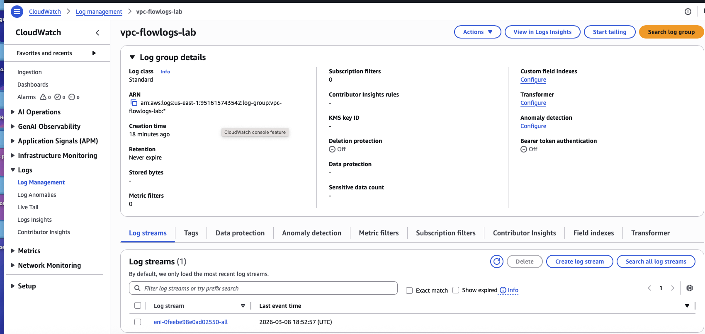
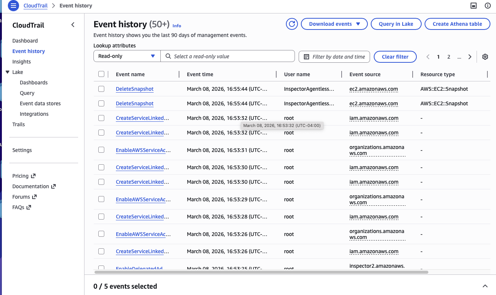
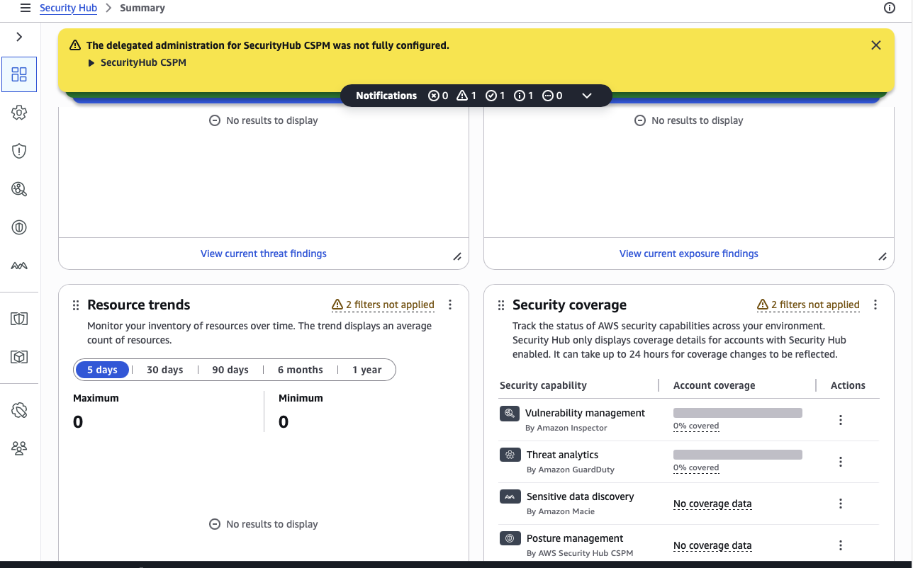

# aws-security-monitoring
AWS security monitoring implementation using VPC Flow Logs, CloudWatch, CloudTrail, Amazon Inspector, and Security Hub.

## Implementation Screenshots

### EC2 Architecture
## Implementation Screenshots

### EC2 Architecture

### EBS Volume Mounted

### VPC Flow Logs Active

### Flow Logs Creation

### Flow Log Entries

### CloudWatch Log Group

### CloudTrail Logs

### CloudTrail Event History

### Amazon Inspector

### AWS Security Hub

### Spot Instance Example

