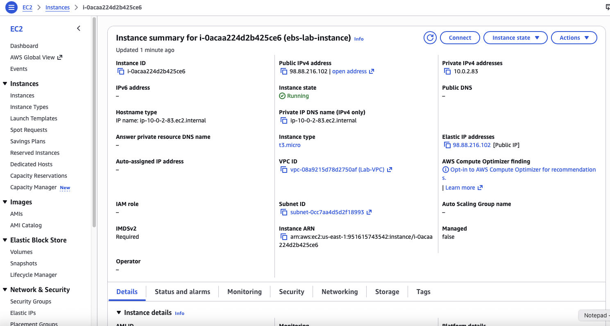
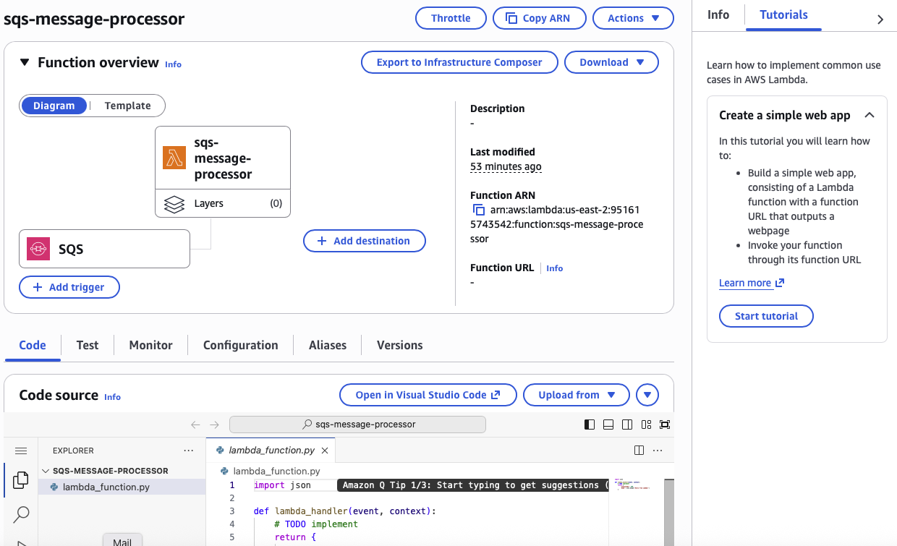
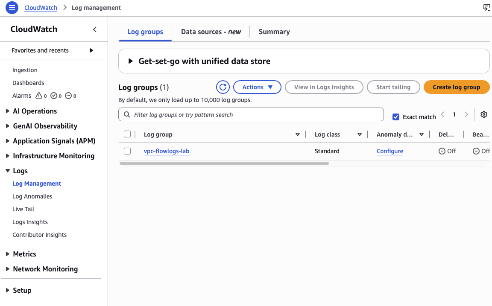
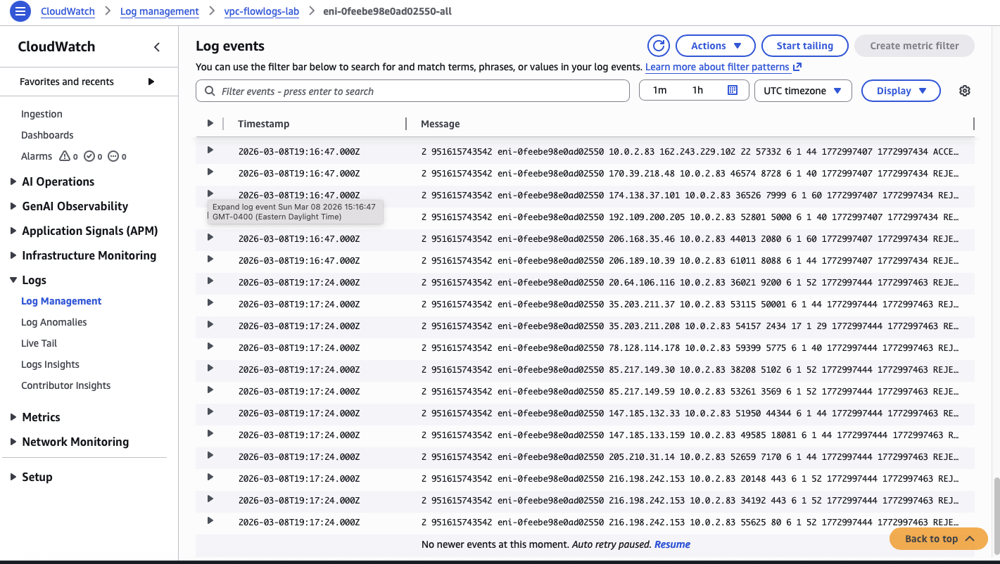
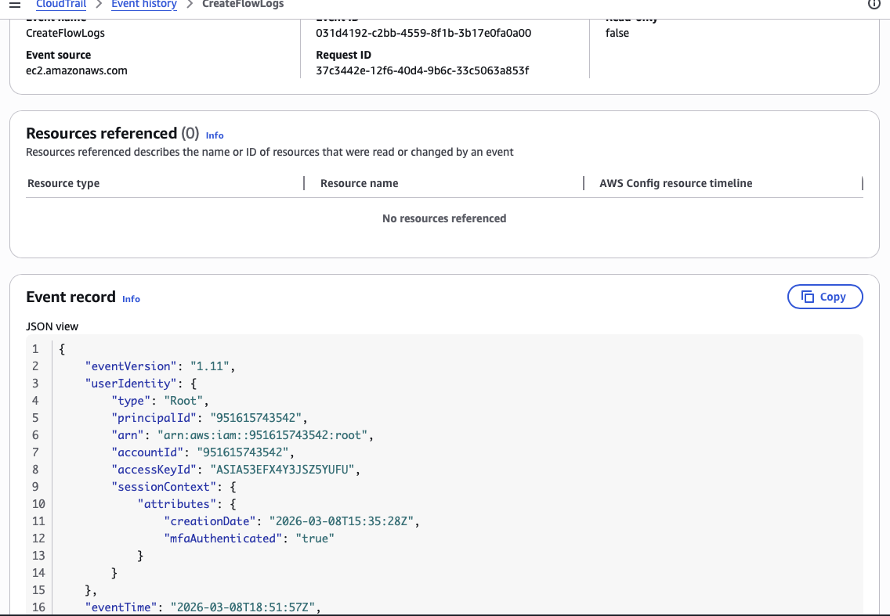
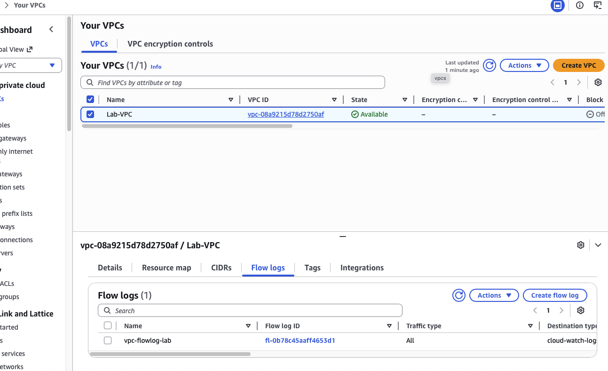
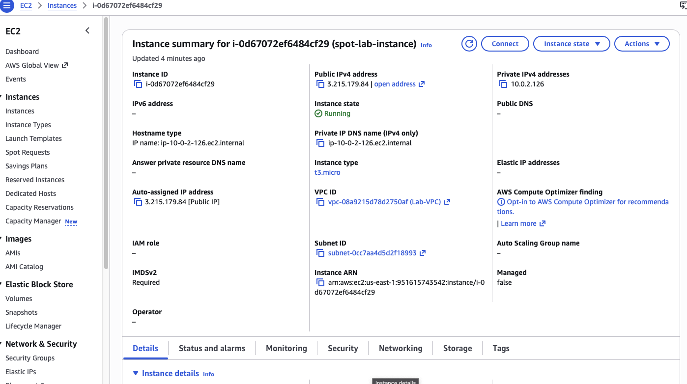

# aws-security-monitoring
AWS security monitoring implementation using VPC Flow Logs, CloudWatch, CloudTrail, Amazon Inspector, and Security Hub.

## Implementation Screenshots

### EC2 Architecture

### EBS Volume Mounted

### VPC Flow Log Active

### VPC Flow Log Creation

### VPC Flow Log Entries

### CloudWatch Log Group

### CloudTrail Logs

### CloudTrail Event History

### Security Hub Dashboard

### Security Hub Findings

### Spot Instance

